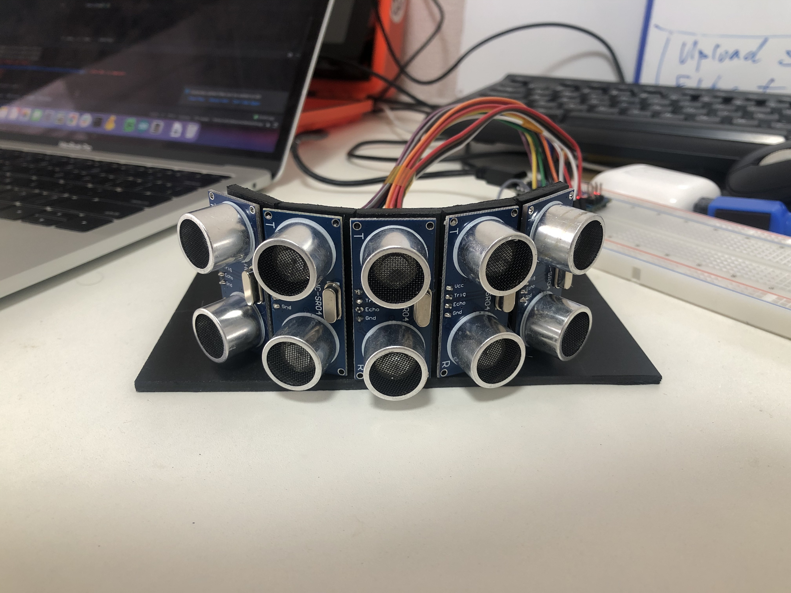
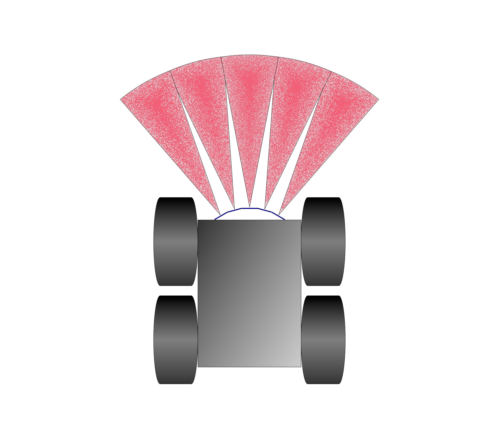
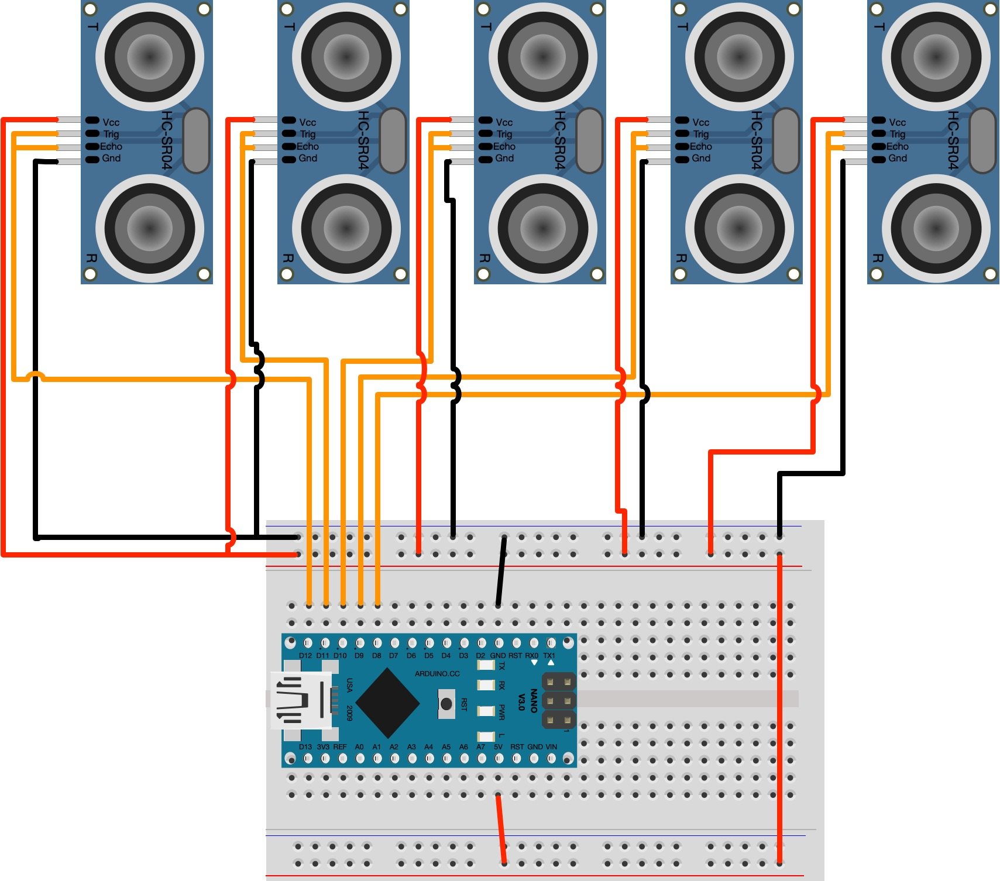

# Ultrasound Sensor Array with Arduino and Python

***This repository is part of [this article](https://albertonaranjo.medium.com/building-a-sonar-sensor-array-with-arduino-and-python-c5b4cf30b945)***

Using the cheap HC-SR04 ultrasonic sensor and an arduino nano we can build a low cost sensor array for robotics.
The arduino code will poll all the sensors and send byte packets via serial interface with the index and the distance 
to a Python app to process.

For measuring the distances we use a sonar technique to calculate the time of flight of the sound. The HC-SR04 is very
inaccurate for distance measurement but can be used as a cheap low level fail-safe system for proximity object detection 
in order to avoid hitting obstacles during navigation. 

## Byte protocol sensor array message

|Byte 1 |Byte 2 |Byte 3         |Byte 4                     |Byte 5                 |
|---	|---	|---	        |---	                    |---                    |
|0x59   |0x59   |sensor_index   |sensor_reading high byte   |sensor_reading low byte|

`sensor_index` is a one byte unsigned integer like `uint8_t`  

`sensor_reading` is a two byte unsigned integer line `unsigend int`

## Sonar Array Configuration with Rover4WD

## Breadboard Schematics

